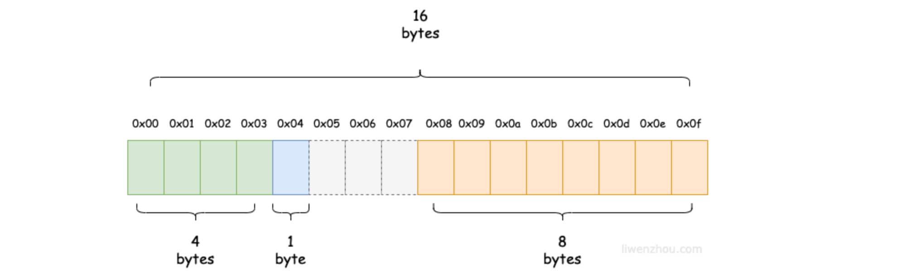
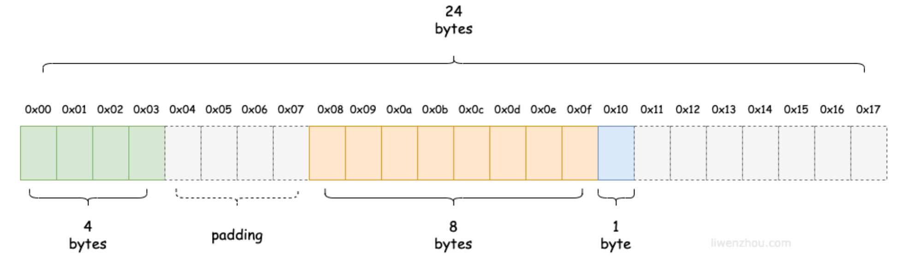

## 基础常识

### 1. 变量和常量

#### 1.1 变量 Variable

程序运行过程中的数据保存在内存中，直接使用内存地址操作数据可读性差且容易出错，所以使用变量保存数据的内存地址，直接借助变量操作相应的数据。

Golang 的每一个变量有自己的类型，**变量必须经过声明才能开始使用！**

```go
// 声明变量（同一作用域不支持重复声明）
var 变量名 数据类型

var name string
var age int
var flag bool

// 批量声明
var (
    a string
    b int
    c bool
    d float32
)
```


#### 1.2 变量的初始化

Go 在声明变量时，会自动对变量对应的内存区域进行初始化操作，即**初始化为其类型的默认值**

```go
// 可以指定初始值
var 变量名 类型 = 表达式

var age int = 25

// 类型推导：可以省略类型，编译器根据右边的值推导类型完成初始化
var name = "Qu"
```

**短变量声明：**在**函数内部**，可以使用 `:=` 声明并初始化变量

```go 
package main

var m = 100 // 全局变量

func main() {
    n := 100
    m := "ww"
}
```

**匿名变量：**在多重复制时，使用 `_` 以忽略某个值，此时编译器会直接忽略，无法读取该值

- 匿名变量不占用命名空间（不存在重复声明），**不会分配内存**


#### 1.3 常量

定义程序运行期间不会改变的值，**常量在定义的时候必须赋值**

```go
const pi = 3.14159 
const e = 2.718 

// 同时声明多个常量，如果省略值，则和上面一行的值相同
const (
	n1 = 100
    n2			// 100
    n3			// 100
)
```


#### 1.4 iota

`iota` 是 Go 的常量计数器，只在常量的表达式中使用

```go
// iota 在 const 关键字出现时重置为 0，每新增一行常量声明 iota 计数一次（定义枚举时好用）
const (
	n1 = iota	//0
    n2			//1
    _			// 可以使用 _ 跳过某些值
    n4			//3
   	n5 = 100	//中间插队
    n6 = iota	//5
)
```

```go
// 定义数量级
const (
	_ = iota
    KB = 1 << (10 * iota)	// 1 左移 10位即 10000000000（二进制），1024（10进制）
    MB = 1 << (10 * iota)
    GB = 1 << (10 * iota)
    TB = 1 << (10 * iota)
    PB = 1 << (10 * iota)
)
```

<br>

### 2. 标识符、关键字

**标识符：**程序员定义的具有特殊意义的词，如变量名、常量名、函数名等，Go 中标识符有字母、数字、下划线组成

**关键字：**编程语言中预先定义好的具有特殊含义的标识符

```go
break        default      func         interface    select
case         defer        go           map          struct
chan         else         goto         package      switch
const        fallthrough  if           range        type
continue     for          import       return       var
```

**其他保留字**

```go
Constants:    true  false  iota  nil

    Types:    int  int8  int16  int32  int64  
              uint  uint8  uint16  uint32  uint64  uintptr
              float32  float64  complex128  complex64
              bool  byte  rune  string  error

Functions:   make  len  cap  new  append  copy  close  delete
             complex  real  imag
             panic  recover

```

<br>

### 3. 命名法与命名空间

#### 3.1 变量命名法

以**驼峰命名法**为基础，根据可见性和场景进行变换

**包名**：全小写 + 无驼峰（简短）；如：`fmt`、`user`

**全局变量/函数/方法**：首字母大写（包外可见） + 驼峰；如：`UserAge`

**局部变量/函数/方法**：首字母小写 + 驼峰；如：`userName`

**常量**

- 普通常量：小驼峰；如：`pi`
- 全局常量/枚举：全大写；如：`MAX_RETRY`


#### 3.2 Go 命名空间

**包命名空间**：不同包之间的标识符不会产生冲突（小写开头）

**块命名空间**：在例如函数体、循环体、条件语句等代码块内，不会影响到外部的命名空间

**方法集命名空间**：与类型关联的方法集，方法名是类型的一部分

**全局命名空间**：大写开头定义全局变量、常量、函数等

<br>

### 4. 基础数据类型

#### 4.1 整型

`int8`	`int16`	`int32`	`int64`

`uint8`	`uint16`	`uint32`	`uint64`

`byte` 即是 `int8`

**特殊整型：**

- `uint`（32 位操作系统为 `uint32`，64 位操作系统为 `uint64`）
- `int`（32 位操作系统为 `int32`，64 位操作系统为 `int64`）
- `uintptr`（无符号整型，用于存放一个指针）

**数字字面量**：便于特殊进制格式定义数字

- `v := 0b00101101`：二进制
- `v := 0o377`：八进制
- `v := 0x1p-2`：十六进制


#### 4.2 浮点型

`float32`	`float63`

- 浮点数最大值常量：`math.MaxFloat32`、`math.MaxFloat64`
- 使用 `fmt` 打印时配合 `%f`


#### 4.3 字符串

Go 字符串内部实现使用 UTF-8 编码，值为双引号 `""` 中的内容

- 字符串底层是一个 `[]byte` 数组，可以和其相互类型转换
- 字符串不能修改，需要转换为 `[]byte` 或 `[]rune` 后修改再转换为 `string`（转换过程重新分配内存，复制字节数组）

```go
// 多行字符串
s1 := `第一行
第二行
第三行`
```

**常用操作：**

```go
// 长度
len(s)

// 拼接
s := s1 + s2
s := fmt.Sprintf("%s%s", s1, s2)

// 分割
func Split(s, sep string) []string		// s-原字符串，sep-分割符（字符或字符串）
s := strings.Split(str, ",")

// 判断是否包含
strings.Contains(str, substr)

// 前缀判断，后缀判断
strings.HasPrefix(str, prefix)
strings.HasSuffix(str, suffix)


// 子串出现的位置
idx1 := strings.Index(str, substr)		// 返回子串 substr 第一次出现的起始索引（不存在返回 -1）
idx2 := strings.LastIndex(str, substr)	// 返回子串 substr 最后一次出现的起始索引

// Join: func Join(a []string, sep string) string
fruits := []string{"苹果", "香蕉", "橙子", "葡萄"}
res := strings.Join(fruits, ", ")	// 输出：苹果, 香蕉, 橙子, 葡萄
```


#### 4.4 byte 和 rune

字符串中单个元素为字符，用`''`包裹起来，Go 语言有两种字符：

- `byte` 或 `uint8`，代表一个 ASCII 码字符
- `rune`，代表一个 UTF-8 字符，实际是一个 `int32`，一个 `rune` 由一个（ASCII）或多个（非 ASCII 字符） `byte` 组成

**字符串底层是一个 `[]byte` 数组，可以和其相互类型转换！**


#### 4.5 复数

`complex64`	`complex128`


#### 4.6 类型转换

Go 只有强制类型转换，且只在两个类型之间支持相互转换时使用

`T(表达式)` 


<br>

### 3. main()


<bar>

## 简答补充

### 1. 值类型和引用类型

**值类型**：

- 值类型：`int系列`，`float系列`，`bool`，`string`，`数组`，`结构体`
- 变量直接存储值，在**栈**中分配内存

**引用类型**：

- 引用类型：`指针`，`slice`，`channel`， `interface`，`map`，`函数`
- 变量存储的是地址，地址对应在**堆**中分配的内存空间，该空间内存储的是值

<br>

### 2. 空结构体 `struct{}` 用法

`struct{}`在 Go 中可以作为**占位符或标记**使用，因为不包含任何字段，所以在内存中**不占用任何空间**

**作为占位符**

```go
// 使用空结构体作为通道元素类型，表示只关注通道的事件，而不需要传输任何数据
ch := make(chan struct{})

// 在map中使用，只关注键时使用，节省掉值占用的内存空间
set := make(map[string]struct{})
```

<br>

### 3. 

<br>

### 4. make 和 new 的区别

二者都是 Go 内置用来分配内存的函数

`make`：用于引用类型 slice、map、channel，返回初始化之后的类型的引用（值）

`new`：用于值类型 int、数组、结构体等，为类型的新值分配置零的内存空间，并返回指针

<br>

### 5. Go 语法糖（待补充）

1. `:=`
2. `range`
3. `defer`
4. 匿名函数和闭包
5. 字面量初始化

<br>

### 6. 闭包

**闭包 = 函数 + 引用环境**：一个闭包继承了函数声明时的作用域，Go 中所有匿名函数都是闭包

```go
func Func1() func(int) int {
    // 引用的 Func1 的局部作用域环境
    var x int
    
    // 函数类型
    return func(delta int) int {
        fmt.Println(x)
        x += delta
        return x
    }
}

func main() {
    var a = Func1()
    var b = Func1()
    
    fmt.Println(a(1))	// 1
    fmt.Println(a(10))	// 11
    fmt.Println(b(1))	// 1
    fmt.Println(b(10))	// 11
}
```

- 闭包捕获的变量和常量是引用传递，不是值传递
- 闭包在运行时可以有多个实例，实例之间互不影响，实例内部的变量是同一个地址（引用）

<br>

### 7. 结构体的内存对齐

Go 在编译的时候会按照一定的规则自动进行内存对齐，这么设计是为了减少 CPU 访问内存的次数，加大 CPU 访问内存的吞吐量

CPU 访问内存时，并不是逐个字节访问，而是以字为单位访问

- 比如 64位 CPU 的字长为 8B，那么 CPU 访问内存的单位也是 8 字节，每次加载的内存数据也是固定的若干字长

结构体内不同的定义顺序，因为内存对齐，会占用不同的空间

```go
type Bar1 struct {
	x int32 // 4
	z bool  // 1
	y *Foo  // 8
}
// 对于 x、z 可以放在一个 8B 空间内
```



```go
type Bar2 struct {
	x int32 // 4
	y *Foo  // 8
	z bool  // 1
}
// 对于 x、y 无法放在一个 8B 空间内，就需要对 4B 的 x 进行内存对齐
```



<br>

### 8. 声明、定义、赋值，类型签名

#### 8.1 区分

> Go 中 “纯声明” 体现在**类型签名**上，其中变量声明后会被编译器自动补全为定义

**声明 Declaration：**仅确定变量的名字和类型，不分配内存、不赋初始值（告诉编译器 "有一个叫 X 的变量，类型是 T"）

**定义 Definition：**声明的基础上，为变量分配内存，并赋予默认值/显式初始值

**赋值 Assignment**：给定义的变量写入新值（修改内存地址中存储的数据）


#### 8.2 类型签名

**类型签名：**对某个实体的类型构成的标准化描述，只关注类型，不关注具体指值/实现

1. 函数签名（最常用）

```go
// 函数签名 = 参数类型列表 + 返回值类型列表（不包含函数名、参数名、函数体）
func add(a int, b int) int {
    return a + b
}

// add 的函数签名：func(int, int) int

// 用类型签名声明一个函数变量
var f func(int, int) int

f = add		// 类型匹配，可赋值
fmt.Println(f(1, 2))	// 3
```

2. 变量的类型签名

```go
// 变量的类型签名就是它的类型本身，即回答“该变量存储什么类型的值”
var num int		// num 的类型签名：int
```

3. 接口的类型签名

> 接口的定义体现为：接口类型声明 + 方法签名约定

接口的类型签名是它包含的方法签名集合，即“实现这个接口需要满足哪些方法的类型要求”

```go
package main

// 定义接口
type Speaker interface {
    // 方法 speak 的类型签名：func() string（无参数，返回string）
    speak() string
    // 方法 setVolume 的类型签名：func(int)（接收int，无返回值）
    setVolume(int)
}

// 只要某个类型实现了上述两个方法（类型签名匹配），就满足 Speaker 接口
type Person struct {
    name string
}

// 方法类型签名匹配：func() string
func (p Person) speak() string {
    return "我是" + p.name
}

// 方法类型签名匹配：func(int)
func (p Person) setVolume(vol int) {
    fmt.Println("音量设置为：", vol)
}
```


<br>

## 语法补充

### 1. int 和 string 互转

- Go 不支持`(int)str`的写法，需要使用`Atoi`将 string 转为 int，使用`Itoa`将 int 转为 string

```go
strconv.Atoi("123")	// 123 转"123"
strconv.Itoa(123)	// "123"转 123
```

<br>

### 2. 使用 for range 进行遍历

`for range`是遍历各种容器最常用的方式，可以根据数据类型的不同返回不同的值

#### 2.1 遍历各种容器

**遍历切片&数组：**返回索引和**元素副本**

```go
// 遍历切片数组
for i, v := range nums {
    ...
}
```

**遍历 Map：**注意，Map 的遍历顺序是随机的

```go
// 遍历 Map
for key, value := range map {
    ...
}
```

**遍历 String：**返回**字节索引**和 **Unicode码点**（rune）


#### 2.2 陷阱和技巧


<br>

## Tips

1. 不能给内置类型和接口定义方法
2. Go 不允许隐式类型转换，`=`两边类型必须相同
3. Go 中所有类型都”实现了“空接口，空接口没有定义任何函数
4. 无论业务大小，并发量多少，都应该选择流式`io.Copy`，而不是一次性读出来`ReadAll`


## 问题记录

1. 常见的panic
2. 需要make初始化的类型（make和New的区别）
3. 锁机制：悲观锁、自旋锁
4. netpoll
5. 对象的对齐方式
6. 并发相关：操信号机制
7. OOM
