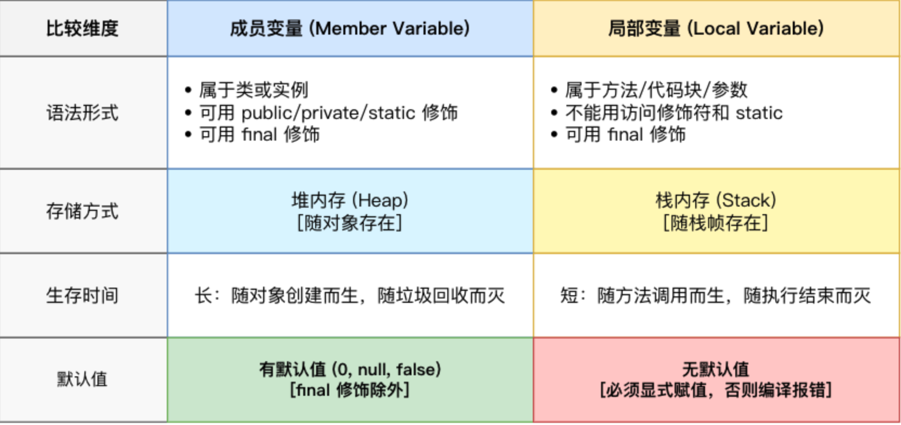

> 先参考 [JavaGuide](https://javaguide.cn/javaguide/intro.html)，速通常用概念、语言特性和基本语法

<br>

## 1. Java 基础

### 1.1 常用概念

**Java SE**（Java Platform, Standard Edition）

**Java EE**（Java Platform, Enterprise Edition）

Java ME（Java Platform，Micro Edition）


**JVM**（Java Virtual Machine, JVM）：Java 虚拟机，实现 Java 语言“一次编译，随处可以运行”

- 并非只有一种

- `.class`：装 Java 字节码，JVM 可以读懂的指令

**JDK**（Java Development Kit）：Java 开发工具包，包含 JRE，javac 和其他工具（javadoc、jdb、jconsole、javap...）

- **javac**（Java Compiler）：Java 语言编译器，`.java` 源代码 —> `.class`
-  **JRE**（Java Runtime Environment）：包含运行 Java 程序所需的环境和类库


**高级编程语言**：编译型，解释型

- Java 是编译与解释共存
- **AOT**（Ahead-of-Time Compilation，提前编译）
- **JIT**（Just-In-Time Compilation，即时编译）


**OpenJDK**：Java 开源源代码项目

**Oracle JDK**：Oracle 公司基于 OpenJDK 项目打包出来的一个商业发行版

<br>

## 1.2 基本语法

> 主要浏览一下 Java 特有的

### 注释

```java
// 单行注释		cmd + /

/*
 	多行注释	cmd + shift + /
*/

/**
 * 文档注释		输入 /**，按 enter
 */
```

<br>

### 基本数据类型

整型：`byte`，`short`，`int`，`long`

浮点型：`float`，`double`

字符类型：`char`（单引号）

布尔型：`boolean`

> Java 的每种基本类型所占存储空间的大小不会像其他大多数语言那样随机器硬件架构的变化而变化

对应包装类型：`Byte`、`Short`、`Integer`、`Long`、`Float`、`Double`、`Character`、`Boolean`

- 浮点数绝大多数都用 `double`
- 所有整型包装类对象之间值的比较，全部使用 equals 方法比较
- 对于包装数据类型来说，`==` 比较两个引用是否指向同一个对象（或都为 `null`）

**装箱**：编译器自动将基础类型变为对应的包装类对象

**拆箱**：编译器自动把包装类对象，变回基本类型

- Java 集合（List、Map、Set）只能存对象，不能存基本类型
- 定义常量和局部变量使用基本类型，避免频繁拆装箱开销

<br>

### 变量



- `final` 修饰变量值不可变，修饰引用类型地址不变，修饰方法不能重写，修饰类不可被继承
- `static`修饰静态变量，被类的所有实例共享，可通过类名访问
- Java 中，声明（确定类型、名称，分配内存空间）就是定义，局部变量必须显式初始化

<br>

### 方法

```java
public void func1(int a, int b) {
    // ...
    return a + b;
}
```

**静态方法**：`static 修饰`

- 调用静态方法可以无需创建对象，直接使用 `类名.方法名`
- 静态方法只能访问静态成员，不允许访问实例成员
- 静态方法能够被再次声明（是隐藏或重载，不是重写）

**重载**：同一个类（或父类和子类之间）中，方法名必须相同，参数类型、个数、顺序至少有一个不同，返回值和访问修饰符可以不同

- 仅有返回值或访问修饰符不同，无法构成重载

**重写**：子类实例方法与父类可访问实例方法之间的声明关系

- 方法名、参数列表必须相同，子类方法返回值类型比父类更小或相等，抛出异常的范围小于等于父类，访问修饰符范围大于等于父类
- 构造方法无法重写
- `private/static/final` 修饰的方法无法被重写
- 强烈建议使用 `@Override` 注解，可以让编译器检查以确保在重写一个方法

**可变长参数**：允许在调用方法时传入不定长度的参数

- 可变参数只能作为函数的最后一个参数
- 方法重载时，优先匹配固定参数的方法

<br>

### 循环

```java
// for-each 遍历用
for (Type Name : 数组或 Iterable 集合) {
    // ...
}

// for 已知次数

// while
whle (先判断) {
    // ...
}
```

<br>

## 1.3 面向对象基础

**POP**（面向过程编程）：把解决问题的过程拆成一个个方法

**OOP**（面向对象编程）：先抽象出对象，用对象执行方法解决问题

- 易维护、易复用、易扩展

### 对象

使用 `new` 运算符创建对象

```java
ClassA s;	 	// 声明对象引用变量，未初始化为 null
s = new ClassA;	// 该引用指向了新创建的对象
```

- 对象使用 `equals()` 判断是否相等，引用使用 `==` 判断，Java 并不暴露或比较物理内存地址

<br>

### 构造方法

**特点**：

1. 名称与类名相同
2. 没有返回值，不使用 `void` 声明
3. 自动执行，无需显式调用

构造方法**不能被重写**，但**可以被重载**

<br>

### 面向对象三大特征

**封装**：把一个对象的状态信息隐藏在对象内部，不允许外部对象之间访问对象的内部消息

**继承**

- 子类对象包含父类声明的实例状态，但父类 `private` 成员不会被子类继承，子类也不能直接访问
- 子类可对父类进行扩展，可以用自己的方法实现父类的方法
- 只能单继承，即一个类只能有一个父类

```java
public class Animal {
    // ...
}

public class Cat extends Animal {
    // ...
}
```

**多态**：一个对象具有多种状态，表现为父类的引用指向子类的实例

- 引用类型的方法调用的是哪个类的方法，在程序运行期间才能确定（动态绑定），重载是在编译器就确定调用哪个版本，即静态绑定
- 子类重写了父类的方法，执行的是子类重写的方法，否则执行父类的方法

```java
Animal a = new Cat();
Animal b = new Dog();

public void feed(Animal animal) {
    animal.sound();
}

feed(a);	// 喵喵
feed(b);	// 汪汪
```

- JVM 执行 `a.sound()`，看的是实际指向的对象类型 `a`或`b`，而非引用类型 `animal`

<br>

### 抽象类

关键字 `abstract` 修饰

- 抽象类 `public abstract class ClassName { ... }`
    - 可以有普通方法
    - 有构造方法，但不能 `new ClassName()` 创建自己的实例
    - `private`、`static`、`final` 不能与 `abstract` 共存
- 抽象方法 `public abstract void funcName();`，没有方法体、`{}`，分号结束

<br>

### 接口

**说明**：规定一组方法签名，使用接口的类需要实现接口内的方法

```java
public interface Action {
    void sound();
}

public class Cat implements Action {
    @Override
    public void sound() {
        System.out.println("哈!");
    }
}
```

- 接口方法默认自带 `public abstract`
    - Java 8 为接口引入 `default` 和 `static` 方法，Java 9 引入 `private` 方法

```java
interface Animal {
    void sound();
    
    // 新增默认方法，不影响之前实现该接口的类（开闭原则）
    default void sleep() {
        System.out.println("Zzz~");
    }
    
    // 新增静态方法，接口内部可以存在工具方法
    static int add(int a, int b) {
        return a + b;
    }
    
    // 接口中有多个 default 和 static 方法，且存在公共逻辑，可抽成 private 方法复用
  
}
```


- 接口没有构造方法，成员变量只能是 `public static final` 常量
- 任何实现了 `Action` 的类都可以复制给 `Action` 引用，即实现新增类不影响调用方法（开闭原则）
- Java 中一个类，只能继承一个父类，但可以实现多个接口

```java
// 声明的引用类型决定调用什么方法，即多态调用（动态绑定）
interface Animal {
    void sound();
}

class Dog implements Animal {
    public void sound() { System.out.println("汪汪"); }
}

class Cat implements Animal {
    public void sound() { System.out.println("喵喵"); }
}

Animal a = new Cat();	// 引用指向了 Cat 实例
a.sound();				// 喵喵
```


**接口 vs 抽象类**

1. 抽象类是 `is-a` 结构，强调继承的子类有相同的骨架，可变部分再各自实现；
2. 接口是 `can-do` 结构，强调实现接口的类能做什么

<br>

### 补充

#### `this` 关键字

指向当前对象的引用，哪个对象调用方法，`this` 就指的是该对象

- 不能在静态方法中使用


#### 深拷贝 vs 浅拷贝

**浅拷贝**：在堆上场景一个新的对象，如果原对象内部的属性是引用类型，则直接复制内部对象的引用地址，和原对象公用

**深拷贝**：完全复制整个对象，包括包含的内部对象

**引用拷贝**：两个不同的引用指向同一个对象


#### Object

`Object` 是一个特殊类，即所有类的父类


#### `==` vs `equals()`

- `==`：基本类型比较值，引用类型比较是否指向同一个对象（或都为 `null`，这里比较的是对象元信息，并发仅是地址）
- `equals()`：是 `Object` 类中的方法，比较两个对象是否相等


#### String

`String` 不可变，每次修改会产生新的对象，并将引用指向新的实例

- 可以使用 `+` 和 `+=` 拼接字符串

<br>

## 1.4 特性

### 异常


